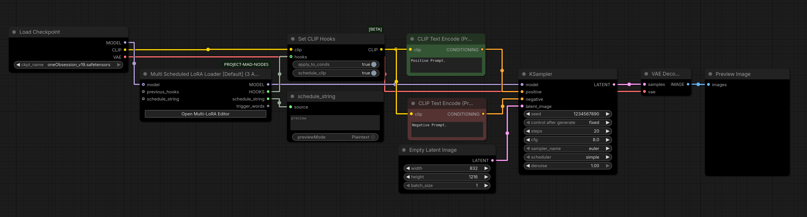
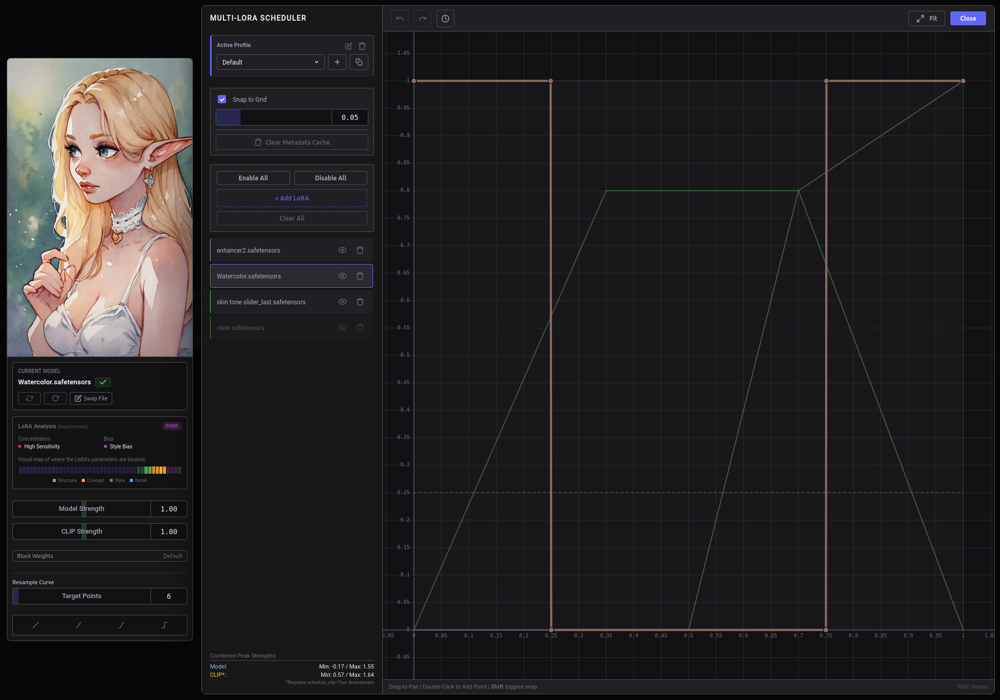
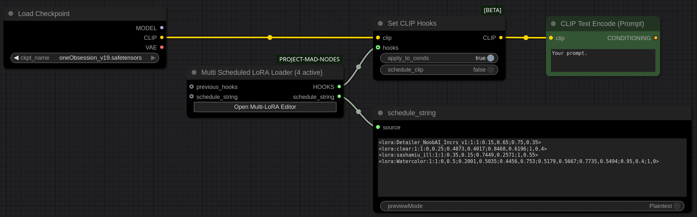
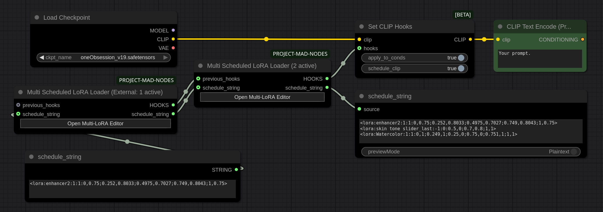
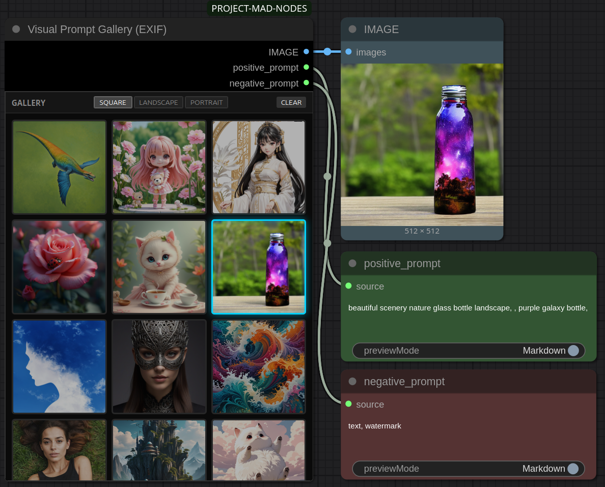

# GUIDE.md
*Still work in progress.*

## Multi Scheduled LoRA Loader

To apply the scheduled strengths to CLIP, you need to connect it to the **Set CLIP Hooks** node (currently a ComfyUI Beta feature).

*> **Note:** This setup is specific to CLIP. If you are not using a CLIP encoder, you only need to utilize the `HOOKS` output with your compatible model patcher.*

**Connection Steps:**

1.  Add a **Set CLIP Hooks** node to your workflow.
2.  Connect your source `CLIP` (e.g., from *Load Checkpoint*) to the `clip` input.
3.  Connect the `HOOKS` output from the **Multi Scheduled LoRA Loader** to the `hooks` input.
4.  Connect the resulting `CLIP` output to your **CLIP Text Encode (Prompt)** nodes.

**Configuration:**

*   **apply_to_conds:** Set this to `True` to ensure the schedule applies correctly.
*   **schedule_clip:** This value is ignored/overridden by the input hooks, so it can be left at default.

<strong>Preview</strong>

 

**Curve Editor Tips:**

1.  Click the "Open Multi-LoRA Editor" button to open a popup window where you can visually draw your schedules.
2.  Add as many LoRAs as you need to the list. The editor handles them all in one view.
*  Model Strength and CLIP Strength curves are tied together (represented by a single curve), however you can set different values for each.
*  Remember to always back up your schedules, most reliable way is to save `schedule_string` output somewhere. If you ever need to revert back to the old configuration, you can do so by plugging in the saved `schedule_string` into the node.
*  *ESC* or clicking outside the editor will close the window without saving it.

<strong>Preview</strong>

 

**Wish I hadn't thought of this:**

*  **Extending Nodes:** You can chain multiple nodes together (please don't 😱) but remember that combined hooks have no way of showing LoRAs from the `previous_hooks` input. It still correctly affects generation process, but if you want to see updated `schedule_string` output you need to plug both `previous_hooks` and `schedule_string` into the node (sanity check 🥹).

<strong>Preview</strong>

 
<b>Clean and simple:</b>
 

 
 
<b>Extending nodes (😭🙏):</b>
 

 

## Visual Prompt Gallery (EXIF)

You can't go wrong with this one.

<strong>Preview</strong>

 

> Go back to the **[README](../readme.md)** section.