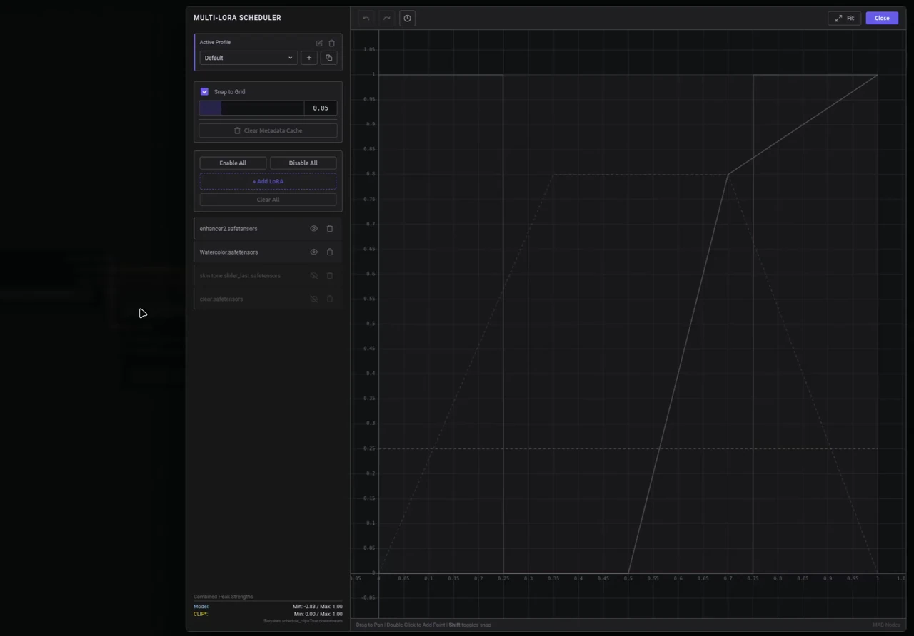

<div align="center">

# Multi Scheduled LoRA Loader



**Dynamic LoRA strength control over generation steps**

<sup>Category: `advanced/hooks/scheduling`</sup>

[Getting Started](#getting-started) | [Curve Editor](#curve-editor) | [Block Weights](#block-weight-system) | [Profiles](#profile-management) | [External Schedule Strings](#external-schedule-strings)

---

</div>

## Overview

Multi Scheduled LoRA Loader applies one or more LoRAs via ComfyUI **HOOKS**, while letting each LoRA’s influence vary over the course of generation.

Common uses:

- Fade a style LoRA in/out.
- Apply one LoRA early for structure, another late for details.
- Stack multiple LoRAs, each with its own timeline.

### Enhanced Experience: LoRA Manager

While this node works standalone, installing **[LoRA Manager](https://github.com/willmiao/ComfyUI-Lora-Manager)** significantly improves the workflow.

Multi Scheduled LoRA Loader detects the sidecar files (metadata and previews) generated by LoRA Manager's **Fetch** action to provide:
1.  **Visual Previews:** See images/videos of the model while editing curves.
2.  **Auto-Triggers:** Automatically populate the `trigger_words` output from CivitAI metadata.
3.  **Architecture Validation:** More accurate model type detection (SDXL, Pony, etc.) based on metadata tags.

If you do not use LoRA Manager, these features still work when you provide your own preview/media files and/or metadata files alongside the LoRA.

## Getting Started

### 1) Add the node

Right-click canvas → `Add Node` → `advanced` → `hooks` → `scheduling` → **Multi Scheduled LoRA Loader**

### 2) Connect the model

1. Connect the **MODEL** output (from Load Checkpoint) to the node’s `model` input.
2. Connect the **MODEL** output (from this node) to your guider/sampler’s `model` input (if modifying Block Weights).

### 3) Apply hooks to CLIP

This node outputs **HOOKS**. To apply them to your text encoder:

1. Add a **Set CLIP Hooks** node.
2. Connect your CLIP (from Load Checkpoint) to its `clip` input.
3. Connect this node’s `HOOKS` output to Set CLIP Hooks’ `hooks` input.
4. Use the resulting CLIP for your text encoding nodes.

<details>
<summary><strong>View connection diagram</strong></summary>


</details>

### Critical settings (Set CLIP Hooks)

| Setting | Recommended | Why |
|---|:---:|---|
| `apply_to_conds` | True | Needed for scheduled model hook application in condition pipelines. |
| `schedule_clip` | True | Allows CLIP strength to follow the schedule (keyframes). |

## Curve Editor

Click **Open Multi-LoRA Editor** to edit LoRAs, strengths, and curves.


### Timeline model

- X axis: generation progress from 0.0 (start) to 1.0 (end)
- Y axis: per-LoRA scheduled strength multiplier (commonly 0.0 to 1.0, but values above 1.0 are allowed)

### Boundary behavior

The backend guarantees the scheduled strength is **0 outside your curve**:

- If your first keyframe starts after 0.0, the node injects a short ramp from 0 to your first point.
- If your last keyframe ends before 1.0, the node injects a short ramp down to 0 and ends at 1.0.

This prevents a LoRA from affecting steps before/after your intended range.

### Canvas controls

| Action | Result |
|---|---|
| Left click + drag on a point | Move keyframe |
| Left click on empty space + drag | Pan |
| Middle click + drag | Pan |
| Double click | Add keyframe |
| Scroll wheel | Zoom |
| Hold `Shift` while dragging a point | Temporarily toggle grid snapping |

### Slider controls

| Action | Result |
|---|---|
| **Drag** | Adjust value normally |
| **Shift + Drag** | Fine adjustment (1/10th sensitivity) |
| **Mouse Wheel** | Increment/decrement by step |
| **Shift + Wheel** | Fine increment/decrement |
| **Double Click** | Reset to default (usually `1.0` for strengths, `0.0` for others) |
| **Click Value** | Type an exact number manually |

*Note: Default step is based on the "Grid Snapping" value.*

### Keyboard shortcuts

| Shortcut | Action |
|---|---|
| `Ctrl+Z` | Undo |
| `Ctrl+Y` | Redo |
| `Escape` | Close dialogs |
| `Enter` | Confirm input (text dialogs) |

### Sidebar controls (per LoRA)

| Control | Function |
|---|---|
| Model Strength | Base strength for model weights (multiplied by the scheduled curve) |
| CLIP Strength | Base strength for CLIP/text-encoder weights (multiplied by the scheduled curve) |
| Enable toggle | Include/exclude this LoRA from the schedule |
| Block Weights | Open block-weight editor (LoRA block scaling) |
| Resample curve | Generate N evenly spaced points between the curve’s endpoints using a selected interpolation |
| Swap file | Change the LoRA file while keeping the curve data |
| Delete | Remove LoRA from the schedule |

### Global controls

| Control | Function |
|---|---|
| Snap to grid | Enable snapping + adjust snap interval |
| Enable/Disable all | Bulk toggle for all LoRAs in the active profile |
| Clear cache | Clears both browser cache and the backend’s LoRA analysis cache |

The preview pane (right side) shows a preview image/video when available for the hovered/selected LoRA.

---

## Block Weight System

Block weights let you scale a LoRA’s effect per detected block. This allows you to emphasize late blocks for "style" while reducing early blocks to preserve "structure".


### Semantic Mapping Guide

When editing block weights or viewing the heatmap, colors indicate the conceptual effect of the blocks:

*   <span style="color:#26a69a">■</span> **POSE (Structure):** Input Blocks (Early). Controls composition and shape.
*   <span style="color:#ffa726">■</span> **IDENTITY (Concept):** Middle Blocks. Controls the main subject and core concepts.
*   <span style="color:#ab47bc">■</span> **STYLE (Art):** Output Blocks (Early/Mid). Controls lighting, color palette, and artistic style.
*   <span style="color:#29b6f6">■</span> **DETAILS (Texture):** Output Blocks (Late). Controls fine pixel details and noise.

---

## Architecture Compatibility

The UI can inspect LoRAs and show an architecture label/badge. When a model is connected, the UI can also warn about mismatches between the model and the LoRA.

---

## Profile Management

Profiles let you keep multiple LoRA schedules and switch between them.

Supported operations:

- New profile
- Duplicate profile
- Rename profile
- Delete profile (if it’s the last profile, a new default profile is created)

When an external schedule is detected in the UI, it can be imported as a new profile.

---

## External Schedule Strings

The node accepts a `schedule_string` input for text-based workflows. This is useful for chaining multiple schedulers, pasting schedules, or driving the node via upstream logic.

### Advanced String Syntax

One LoRA per line. You can mix and match arguments. The parser handles keyframes, presets, and raw vectors.

```text
<lora:FILENAME:MODEL:CLIP:KEYFRAMES:PRESET:VECTORS>
```

#### Argument Breakdown

| Argument | Example | Description |
| :--- | :--- | :--- |
| **Filename** | `MyLora.safetensors` | Fuzzy matching is applied. Name or Name+Ext allowed. |
| **Model Strength** | `1.0` | Base multiplier for model weights. |
| **CLIP Strength** | `1.0` | Base multiplier for CLIP weights. |
| **Keyframes** | `0,0;0.5,1;1,0` | Pairs of `Time,Value` separated by semicolons. Time is 0.0 to 1.0. |
| **Preset** | `preset=Style` | Applies a semantic block weight strategy (e.g. `STYLE_FOCUSED`). |
| **Vectors** | `vectors=in_0=0`| Explicitly sets specific block vectors. Overrides presets. |

#### Examples

**1. Basic Static Strength:**
```text
<lora:my_style:0.8:1.0>
```

**2. Fade-In Curve:**
```text
<lora:FilmGrain:1.0:1.0:0.0,0.0;1.0,1.0>
```

**3. Block Weight Preset:**
```text
<lora:AnimeStyle:1.0:1.0:preset=STYLE_FOCUSED>
```

**4. Explicit Vectors:**
```text
<lora:Character:0.8:1.0:vectors=input_0=0.5;middle_0=1.0;output_5=1.5>
```

For full parsing rules, legacy positional formats, and parsing edge cases, see [Technical Reference](./TECHNICAL.md#external-schedule-string-parsing).

---

## Outputs

| Output | Type | Description |
|---|---|---|
| `MODEL` | MODEL | Clone of the input model with the final hook group registered (or `None` if `model` input is not provided). |
| `HOOKS` | HOOKS | Hook group containing this node’s LoRA hooks plus any forwarded/combined upstream hooks. |
| `schedule_string` | STRING | Serialized schedule string produced by this node (useful for debugging and chaining). |
| `trigger_words` | STRING | Unique, comma-separated trigger words extracted from LoRA metadata JSON files when available. |

---

## Related Documentation

- [Technical Reference](./TECHNICAL.md)
- [Troubleshooting](./TROUBLESHOOTING.md)
- [Back to Main Documentation](../readme.md)