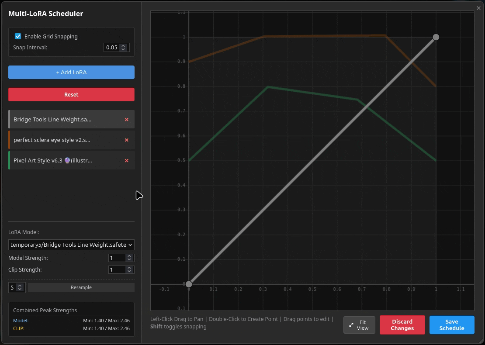

# PROJECT-MAD-NODES

[](https://registry.comfy.org/publishers/projectmad/nodes/project-mad-nodes)
[](LICENSE)
[]()

**Advanced control for LoRA scheduling and visual prompt management in ComfyUI.**

This collection focuses on distinct quality-of-life improvements: precisely controlling LoRA strength over time using visual curves and managing your prompt inspiration library directly within the node interface.

---

## Installation

### Method 1: ComfyUI Manager (Recommended)
1. Open **ComfyUI Manager**.
2. Click **"Install Custom Nodes"**.
3. Search for `PROJECT-MAD-NODES`.
4. Click **Install** and restart ComfyUI.

### Method 2: Manual Installation
Clone this repository into your `custom_nodes` folder:
```bash
cd ComfyUI/custom_nodes/
git clone https://github.com/PROJECTMAD/PROJECT-MAD-NODES.git
```

---

## Key Features (Nodes)

### 1. Multi Scheduled LoRA Loader
**Stop guessing numbers. Start drawing curves.**

Control Model and CLIP strength over the course of the generation steps. Instead of static values, create fade-ins, fade-outs, or complex strength patterns using a built-in graphical editor.

<p align="center">
  
</p>

*   **Visual Curve Editor:** Draw your schedule visually in a popup window. No manual coordinate typing required.
*   **Independent Control:** Set different curves for Model and CLIP strength for every LoRA.
*   **Batch Management:** Handle multiple LoRAs in a single list view with a unified timeline.
*   **Grid Snapping & Resampling:** Tools to help you align keyframes and smooth out your curves automatically.
*   **State Management:** Undo/Redo stack, import functionality, and visibility toggles.

> **Note:** Requires connecting to the **Set CLIP Hooks** node (official ComfyUI feature). See the [Usage Guide](./docs/GUIDE.md) for configuration details.

### 2. Visual Prompt Gallery (EXIF)
**Your personal asset browser inside ComfyUI.**

Drag, drop, and reuse. This node acts as a visual container for your reference images, automatically extracting prompts to help you switch styles instantly.

<p align="center">
  
</p>

*   **Drag & Drop Import:** Simply drag images from your OS directly onto the node (saved locally to `input/visual_gallery`).
*   **Auto-Metadata Extraction:** Extracts Positive/Negative prompts from EXIF, ComfyUI PNG info, and CivitAI metadata.
*   **Gallery Mode:** Resizable floating window with thumbnail views (Square, Portrait, Landscape).
*   **Offline Capable:** Uses `exifreader` (cached after first load), respecting your privacy and offline workflows.

---

## Quick Start (Workflows)

*Nothing here yet.*

---

## Requirements

*   **ComfyUI:** Latest version recommended.
*   **Internet:** Only required once for the initial load of the gallery JS library (it works offline afterwards).

## Credits

*   **[ComfyUI Team](https://github.com/comfyanonymous/ComfyUI)** for building the incredible foundation that made this humble collection of nodes possible.