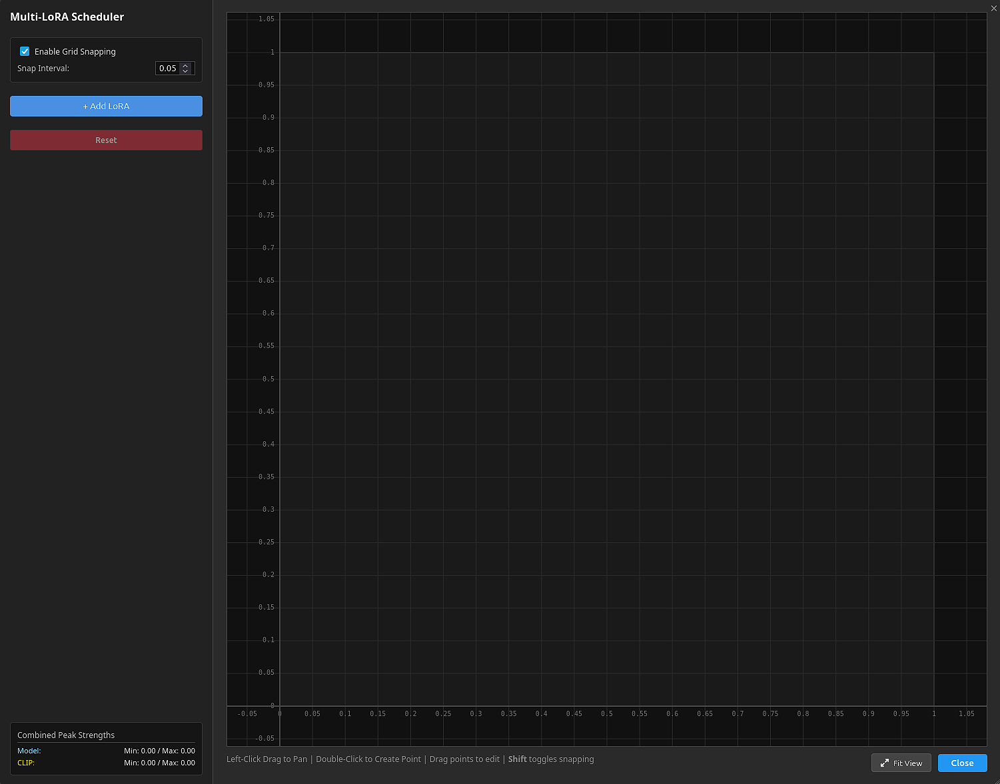
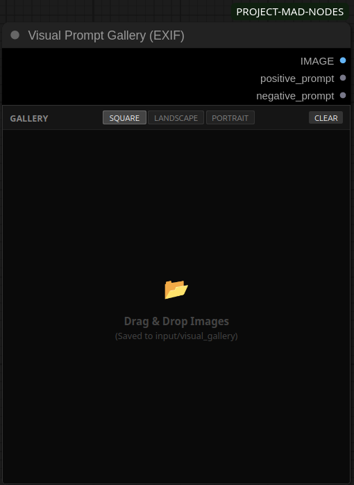

# PROJECT-MAD-NODES


* What's this for and why does it exist?
* Honestly, I don't even know.

On a serious note, this is a small collection of custom nodes for ComfyUI designed to help with LoRA scheduling and prompt management.
As long as I'm having fun with ComfyUI and discover new features that I can't live without, I'll add them to this package. Well, most of them. Hopefully..


## Multi Scheduled LoRA Loader

This node allows you to control LoRA strengths (Model and CLIP) over the course of a generation step schedule. Instead of a static strength value, you can define curves to fade LoRAs in and out or create specific strength patterns.

<a href="./assets/multi_scheduled_lora_loader_node.png"></a>

### Key Features

*   **Visual Curve Editor:** Click the "Open Multi-LoRA Editor" button to open a popup window where you can visually draw your schedules. You don't need to type out coordinates manually.
*   **Independent Curves:** You can set different curves for Model Strength and CLIP Strength for every LoRA you add.
*   **Multiple LoRAs:** You can add as many LoRAs as you need to the list. The editor handles them all in one view.
*   **Grid Snapping:** The editor includes a snapping feature to help you align keyframes to specific values or time steps.
*   **Stats Panel:** The editor calculates the combined peak strength of all active LoRAs so you can see if your total values are getting too high.
*   **External Input Support:** The node accepts a text string input. If you have a schedule string generated by another node or saved in a text file, you can pipe it in to override the internal settings.
*   **Keyframe Resampling:** If you have two points and want to add more detail, there is a tool to automatically generate intermediate points between them.

*For more information on LoRA scheduling, refer to the [official ComfyUI blog](https://blog.comfy.org/p/masking-and-scheduling-lora-and-model-weights).*


## Visual Prompt Gallery (EXIF)

This node acts as a visual storage container for your reference images. It reads the metadata from the images and outputs the positive and negative prompts, allowing you to quickly switch styles or reuse prompts by clicking on thumbnails.

<a href="./assets/visual_prompt_gallery_(exif)_node.png"></a>

### Key Features

*   **Drag and Drop:** You can drag images directly from your computer onto the gallery area to add them. The images are automatically uploaded to a `visual_gallery` subfolder in your ComfyUI input directory.
*   **Metadata Extraction:** When you select an image, the node attempts to read generation data. It supports standard EXIF data, ComfyUI workflow JSON embedded in PNGs, and CivitAI-style metadata.
*   **Outputs:** The node provides three outputs: the image itself (as a tensor), the Positive Prompt string, and the Negative Prompt string.
*   **Gallery UI:** The interface is a floating window attached to the node. You can resize the node to change the gallery size.
*   **View Options:** You can toggle between Square, Landscape, and Portrait aspect ratios for the thumbnails to better view your images.


## Requirements

*   **Python (Server):** No additional installation required. The nodes rely solely on standard ComfyUI dependencies (Torch, PIL, Numpy).
*   **JavaScript (Client):** The interface uses `exifreader` to parse metadata. This is fetched automatically from a CDN. An active internet connection is required for the **initial load**; however, most browsers will cache the library, allowing for offline use in subsequent sessions.

## Installation

1. Navigate to your ComfyUI `custom_nodes` directory in a terminal.
2. Clone this repository:
   ```bash
   git clone https://github.com/PROJECTMAD/PROJECT-MAD-NODES.git
   ```
3. Restart ComfyUI.

## Usage Guide
> For a strict, step-by-step tutorial, please read the **[Usage Guide](./docs/GUIDE.md)**.

## Credits & Special Thanks

*   **[The ComfyUI Team](https://github.com/comfyanonymous/ComfyUI):** For building the incredible foundation that made this humble collection of nodes possible.
*   **[Minthy](https://huggingface.co/Minthy):** For creating the [T5 Gemma Adapter](https://huggingface.co/Minthy/Rouwei-T5Gemma-adapter_v0.2). This dedicated Text Encoder serves as a powerful alternative to the older CLIP model, offering significantly better prompt adherence and understanding. It breathes new life into SDXL-based models.